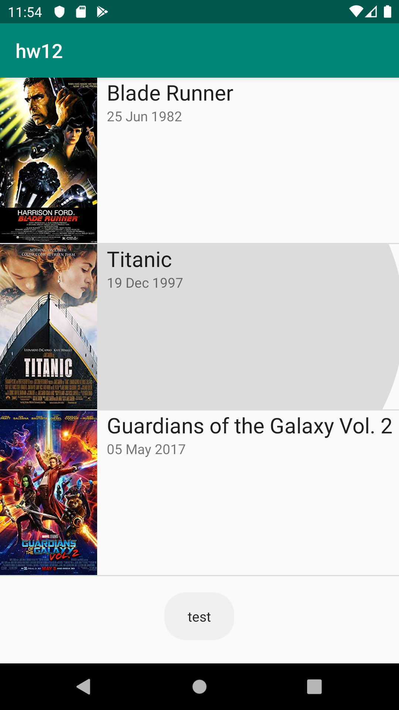

# HW12 android list app

0. Use the Android App template we created in the class.
1. Create an Android app with RecyclerView (to display movies) and AsyncTask (to fetch and parse JSON array of movies from the internet https://api.myjson.com/bins/nfvfi).
2. Display Movie title, year, running time, and plot fields.
3. [Optional: for extra credit] Display another Activity with Movie details when you click on an element of RecyclerView
4. [Optional: for extra credit] Store Movie data using ContentProvider, retrieve and display it when there is no connectivity.
5. Submit a link to a successful build in Travis CI.

